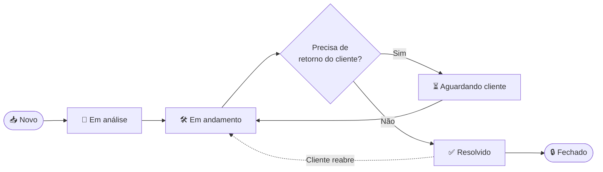

<div align="center">

# 🌌 Astro SaaS

### Sistema de Help Desk moderno, rápido e feito para escalar

Centralize o atendimento, organize tickets e encante seus clientes — tudo em um só lugar.


[🚀 Começar agora](#-primeiros-passos) · [📚 Conceitos](#-conceitos-fundamentais) · [🧩 API](#-api-e-webhooks) · [💬 Suporte](#-suporte)

</div>

---

## 📑 Sumário

| # | Seção | Descrição |
|---|-------|-----------|
| 1 | [Sobre o Astro SaaS](#-sobre-o-astro-saas) | Visão geral e objetivos da plataforma |
| 2 | [Principais recursos](#-principais-recursos) | O que você pode fazer com o Astro |
| 3 | [Primeiros passos](#-primeiros-passos) | Do cadastro ao primeiro ticket em minutos |
| 4 | [Conceitos fundamentais](#-conceitos-fundamentais) | Tickets, filas, SLAs e mais |
| 5 | [Ciclo de vida do ticket](#-ciclo-de-vida-do-ticket) | Como um ticket nasce, evolui e é resolvido |
| 6 | [Papéis e permissões](#-papéis-e-permissões) | Quem pode fazer o quê |
| 7 | [Configurações](#-configurações) | SLAs, automações, canais e notificações |
| 8 | [Integrações](#-integrações) | Conecte suas ferramentas favoritas |
| 9 | [API e Webhooks](#-api-e-webhooks) | Automatize e integre via código |
| 10 | [FAQ](#-faq) | Perguntas frequentes |
| 11 | [Solução de problemas](#-solução-de-problemas) | Erros comuns e como resolver |
| 12 | [Glossário](#-glossário) | Termos usados na documentação |
| 13 | [Changelog](#-changelog) | Histórico de versões |
| 14 | [Suporte](#-suporte) | Como falar com a gente |

---

## 🌌 Sobre o Astro SaaS

O **Astro SaaS** é uma plataforma de **Help Desk** em nuvem que ajuda equipes de suporte a gerenciar solicitações de clientes de forma organizada, rápida e mensurável.

> [!NOTE]
> Esta documentação cobre a versão **1.0.0** do Astro SaaS. Alguns recursos podem variar de acordo com o seu plano.

### 🎯 Nossa missão

Transformar o suporte ao cliente em uma **vantagem competitiva**, e não em um gargalo.

### 💡 Para quem é

- 🏢 **Empresas** que precisam organizar o atendimento ao cliente
- 🧑‍💻 **Times de TI** que recebem chamados internos
- 🚀 **Startups** que querem escalar o suporte sem perder qualidade
- 🏪 **Agências e prestadores de serviço** que atendem vários clientes

---

## ✨ Principais recursos

| Recurso | Descrição | Disponível em |
|---------|-----------|:-------------:|
| 🎫 **Gestão de tickets** | Criação, atribuição, priorização e acompanhamento completo | Todos os planos |
| 📥 **Multicanal** | E-mail, formulário web, chat e API em uma caixa de entrada única | Todos os planos |
| ⏱️ **SLA inteligente** | Metas de resposta e resolução com alertas automáticos | Pro · Enterprise |
| 🤖 **Automações** | Regras que atribuem, classificam e respondem sozinhas | Pro · Enterprise |
| 📚 **Base de conhecimento** | Artigos públicos e internos para autoatendimento | Todos os planos |
| 📊 **Relatórios e métricas** | Dashboards de desempenho, satisfação e volume | Pro · Enterprise |
| 🔌 **Integrações** | Slack, WhatsApp, Zapier, e mais | Pro · Enterprise |
| 🔐 **Segurança** | Controle de acesso por papel, logs de auditoria e SSO | Enterprise |

---

## 🚀 Primeiros passos

Comece a usar o Astro SaaS em **5 passos simples**.

### 1️⃣ Crie sua conta

Acesse [`https://app.astrosaas.com`](https://app.astrosaas.com) e clique em **Criar conta**. Informe seu e-mail corporativo e confirme o cadastro.

### 2️⃣ Configure sua organização

Defina o nome da empresa, o fuso horário e o logotipo em **Configurações → Organização**.

### 3️⃣ Convide sua equipe

Vá em **Configurações → Equipe → Convidar membros** e adicione agentes e administradores.

### 4️⃣ Conecte um canal de entrada

Escolha por onde os clientes vão falar com você:

- 📧 **E-mail** — encaminhe `suporte@suaempresa.com` para o endereço do Astro
- 🌐 **Formulário web** — incorpore o widget no seu site
- 💬 **Chat** — ative o chat ao vivo
- 🔗 **API** — abra tickets via código

### 5️⃣ Receba seu primeiro ticket 🎉

Envie uma mensagem de teste pelo canal configurado e veja o ticket aparecer na sua caixa de entrada.

> [!TIP]
> Use o **modo de demonstração** em *Configurações → Avançado* para popular a conta com tickets de exemplo e explorar a plataforma sem risco.

---

## 🧠 Conceitos fundamentais

<table>
<tr>
<td width="50%" valign="top">

### 🎫 Ticket
Registro de uma solicitação do cliente. Cada ticket possui **assunto**, **descrição**, **prioridade**, **status**, **responsável** e **histórico de interações**.

</td>
<td width="50%" valign="top">

### 📂 Fila
Agrupamento de tickets por departamento, produto ou tipo de problema. Ex.: *Financeiro*, *Suporte Técnico*, *Vendas*.

</td>
</tr>
<tr>
<td width="50%" valign="top">

### ⏱️ SLA
*Service Level Agreement.* Define o tempo máximo para a **primeira resposta** e para a **resolução** de um ticket, de acordo com sua prioridade.

</td>
<td width="50%" valign="top">

### 🏷️ Tags
Etiquetas livres para classificar tickets e facilitar buscas, filtros e relatórios.

</td>
</tr>
<tr>
<td width="50%" valign="top">

### 👤 Solicitante
A pessoa (cliente ou colaborador) que abriu o ticket. Cada solicitante tem um perfil com histórico completo.

</td>
<td width="50%" valign="top">

### 🧑‍💼 Agente
Membro da equipe responsável por responder e resolver tickets.

</td>
</tr>
</table>

### 🚦 Níveis de prioridade

| Prioridade | Cor | 1ª resposta (padrão) | Resolução (padrão) |
|------------|:---:|:--------------------:|:------------------:|
| 🔴 **Urgente** | Vermelho | 15 min | 4 h |
| 🟠 **Alta** | Laranja | 1 h | 8 h |
| 🟡 **Média** | Amarelo | 4 h | 24 h |
| 🟢 **Baixa** | Verde | 8 h | 72 h |

> [!IMPORTANT]
> Os tempos acima são valores padrão e podem ser personalizados por plano ou por cliente em **Configurações → SLA**.

---

## 🔄 Ciclo de vida do ticket



### 📌 Status disponíveis

| Status | Significado | Conta no SLA? |
|--------|-------------|:-------------:|
| 📥 **Novo** | Ticket recém-criado, ainda sem responsável | ✅ |
| 👀 **Em análise** | Um agente está avaliando o problema | ✅ |
| 🛠️ **Em andamento** | O problema está sendo resolvido | ✅ |
| ⏳ **Aguardando cliente** | Dependemos de uma resposta do solicitante | ⏸️ Pausado |
| ✅ **Resolvido** | Solução entregue, aguardando confirmação | ⏹️ |
| 🔒 **Fechado** | Ticket encerrado definitivamente | ⏹️ |

---

## 👥 Papéis e permissões

| Permissão | 👑 Admin | 🧑‍💼 Agente | 👁️ Observador | 👤 Solicitante |
|-----------|:-------:|:---------:|:-------------:|:--------------:|
| Criar tickets | ✅ | ✅ | ❌ | ✅ |
| Responder tickets | ✅ | ✅ | ❌ | ✅ (os próprios) |
| Atribuir tickets | ✅ | ✅ | ❌ | ❌ |
| Notas internas | ✅ | ✅ | 👁️ Leitura | ❌ |
| Ver relatórios | ✅ | ⚠️ Limitado | ✅ | ❌ |
| Gerenciar equipe | ✅ | ❌ | ❌ | ❌ |
| Configurar SLA e automações | ✅ | ❌ | ❌ | ❌ |
| Acessar faturamento | ✅ | ❌ | ❌ | ❌ |

---

## 🔧 Configurações

### ⏱️ Configurando um SLA

1. Acesse **Configurações → SLA → Nova política**
2. Defina o **nome** e as **condições** (ex.: cliente *Premium*)
3. Informe os tempos de **primeira resposta** e **resolução** por prioridade
4. Ative os **alertas** (e-mail e notificação no app)
5. Clique em **Salvar política**

### 🤖 Exemplo de automação

<details>
<summary><b>📌 Atribuir tickets urgentes automaticamente</b></summary>

<br>

| Campo | Valor |
|-------|-------|
| **Gatilho** | Quando um ticket for criado |
| **Condição** | Prioridade igual a `Urgente` |
| **Ação 1** | Atribuir à fila `Plantão` |
| **Ação 2** | Notificar `#suporte-urgente` no Slack |
| **Ação 3** | Adicionar a tag `escalado` |

</details>

<details>
<summary><b>📌 Fechar tickets inativos</b></summary>

<br>

| Campo | Valor |
|-------|-------|
| **Gatilho** | A cada hora |
| **Condição** | Status `Aguardando cliente` há mais de 7 dias |
| **Ação 1** | Enviar e-mail de aviso ao solicitante |
| **Ação 2** | Alterar status para `Fechado` após 48 h sem resposta |

</details>

### 🔔 Notificações

| Evento | E-mail | App | Slack |
|--------|:------:|:---:|:-----:|
| Novo ticket atribuído a mim | ✅ | ✅ | ⚪ |
| Resposta do cliente | ✅ | ✅ | ⚪ |
| SLA próximo de vencer | ✅ | ✅ | ✅ |
| SLA violado | ✅ | ✅ | ✅ |

---

## 🔌 Integrações

| Integração | Categoria | O que faz |
|------------|-----------|-----------|
| 💬 **Slack** | Comunicação | Notificações e criação de tickets a partir de mensagens |
| 📱 **WhatsApp** | Canal | Atendimento direto pelo WhatsApp Business |
| ⚡ **Zapier** | Automação | Conecte o Astro a milhares de aplicativos |
| 📧 **Gmail / Outlook** | E-mail | Sincronização de caixas de entrada |
| 🧾 **CRMs** | Vendas | Visualize dados do cliente dentro do ticket |
| 🐙 **GitHub / Jira** | Desenvolvimento | Escale bugs para o time de engenharia |

> [!NOTE]
> Novas integrações são adicionadas com frequência. Consulte o [Changelog](#-changelog) para ficar por dentro.

---

## 🧩 API e Webhooks

A API REST do Astro SaaS permite integrar o Help Desk aos seus próprios sistemas.

### 🔑 Autenticação

Todas as requisições exigem um **token de acesso** enviado no cabeçalho `Authorization`. Gere o seu em **Configurações → Desenvolvedores → Tokens de API**.

> [!WARNING]
> Nunca exponha seu token em código público ou no front-end. Trate-o como uma senha.

### 🌐 URL base

```
https://api.astrosaas.com/v1
```

### 🎫 Criar um ticket

**Requisição**

```bash
curl -X POST https://api.astrosaas.com/v1/tickets \
  -H "Authorization: Bearer SEU_TOKEN_AQUI" \
  -H "Content-Type: application/json" \
  -d '{
    "subject": "Não consigo acessar minha conta",
    "description": "Ao tentar fazer login, aparece o erro 403.",
    "priority": "high",
    "requester": {
      "name": "Maria Silva",
      "email": "maria@exemplo.com"
    },
    "tags": ["login", "acesso"]
  }'
```

**Resposta** — `201 Created`

```json
{
  "id": "tkt_8f3a9c21",
  "subject": "Não consigo acessar minha conta",
  "status": "new",
  "priority": "high",
  "created_at": "2026-09-21T14:32:10Z",
  "sla": {
    "first_response_due": "2026-09-21T15:32:10Z",
    "resolution_due": "2026-09-21T22:32:10Z"
  }
}
```

### 📋 Principais endpoints

| Método | Endpoint | Descrição |
|:------:|----------|-----------|
| `GET` | `/tickets` | Lista tickets com filtros e paginação |
| `POST` | `/tickets` | Cria um novo ticket |
| `GET` | `/tickets/{id}` | Retorna os detalhes de um ticket |
| `PATCH` | `/tickets/{id}` | Atualiza status, prioridade ou responsável |
| `POST` | `/tickets/{id}/replies` | Adiciona uma resposta ou nota interna |
| `GET` | `/requesters` | Lista solicitantes |
| `GET` | `/agents` | Lista agentes da organização |

### 🪝 Webhooks

Receba eventos em tempo real no seu servidor.

| Evento | Disparado quando… |
|--------|-------------------|
| `ticket.created` | Um novo ticket é criado |
| `ticket.updated` | Status, prioridade ou responsável mudam |
| `ticket.replied` | Há uma nova resposta no ticket |
| `ticket.resolved` | O ticket é marcado como resolvido |
| `sla.breached` | Um SLA é violado |

**Exemplo de payload**

```json
{
  "event": "ticket.created",
  "timestamp": "2026-09-21T14:32:10Z",
  "data": {
    "id": "tkt_8f3a9c21",
    "subject": "Não consigo acessar minha conta",
    "priority": "high"
  }
}
```

### ⚡ Limites e códigos de resposta

| Código | Significado |
|:------:|-------------|
| `200` | Sucesso |
| `201` | Recurso criado |
| `400` | Requisição inválida |
| `401` | Token ausente ou inválido |
| `403` | Sem permissão para o recurso |
| `404` | Recurso não encontrado |
| `429` | Limite de requisições excedido |
| `500` | Erro interno — tente novamente |

---

## ❓ FAQ

<details>
<summary><b>Posso testar o Astro SaaS gratuitamente?</b></summary>

<br>

Sim! Oferecemos um período de testes gratuito, sem necessidade de cartão de crédito.

</details>

<details>
<summary><b>Como importo tickets de outra plataforma?</b></summary>

<br>

Acesse **Configurações → Importar dados** e envie um arquivo `.csv` seguindo o nosso modelo padrão.

</details>

<details>
<summary><b>Posso personalizar o portal do cliente com a minha marca?</b></summary>

<br>

Sim. Você pode alterar logotipo, cores e domínio em **Configurações → Portal do cliente**.

</details>

<details>
<summary><b>Como funciona o pagamento?</b></summary>

<br>

O Astro SaaS é cobrado por **agente ativo por mês**. Você pode alterar ou cancelar o plano quando quiser.

</details>

<details>
<summary><b>Meus dados estão seguros?</b></summary>

<br>

Sim. Os dados são criptografados em trânsito e em repouso, com backups automáticos e controle de acesso por papel.

</details>

---

## 🩺 Solução de problemas

| Problema | Possível causa | Solução |
|----------|----------------|---------|
| 📧 E-mails não viram tickets | Encaminhamento mal configurado | Verifique o endereço de encaminhamento em **Canais → E-mail** |
| 🔔 Não recebo notificações | Preferências desativadas | Revise **Perfil → Notificações** |
| 🔑 Erro `401` na API | Token inválido ou expirado | Gere um novo token em **Desenvolvedores** |
| ⏱️ SLA não está sendo aplicado | Nenhuma política ativa para o ticket | Confira as condições da política em **Configurações → SLA** |
| 🪝 Webhook não dispara | URL inacessível ou sem HTTPS | Teste a URL e confirme que responde `200` |

> [!TIP]
> Ainda com dúvidas? Consulte a seção de [Suporte](#-suporte).

---

## 📖 Glossário

| Termo | Definição |
|-------|-----------|
| **Help Desk** | Central de suporte que recebe e gerencia solicitações de clientes |
| **Ticket** | Registro individual de uma solicitação de atendimento |
| **SLA** | Acordo de nível de serviço; define prazos de resposta e resolução |
| **Solicitante** | Pessoa que abre o ticket |
| **Agente** | Profissional que atende os tickets |
| **Fila** | Agrupamento de tickets por tema ou departamento |
| **Nota interna** | Comentário visível apenas para a equipe |
| **Macro** | Resposta pré-definida para agilizar o atendimento |
| **CSAT** | Pesquisa de satisfação do cliente após o atendimento |
| **Webhook** | Notificação automática enviada a outro sistema quando um evento ocorre |

---

## 📝 Changelog

### `v1.0.0` — 2026-09-21

#### ✨ Novidades
- Lançamento oficial do **Astro SaaS**
- Gestão completa de tickets com filas, tags e prioridades
- SLA configurável com alertas automáticos
- API REST e Webhooks
- Base de conhecimento com artigos públicos e internos

#### 🐛 Correções
- Nenhuma — é a primeira versão! 🎉

---

## 💬 Suporte

Precisa de ajuda? Estamos por aqui.

| Canal | Contato | Horário |
|-------|---------|---------|
| 📧 **E-mail** | suporte@astrosaas.com | 24/7 |
| 💬 **Chat** | Dentro do aplicativo | Seg–Sex, 9h às 18h |
| 📚 **Central de ajuda** | https://ajuda.astrosaas.com | 24/7 |
| 🐞 **Reportar bug** | bugs@astrosaas.com | 24/7 |

---

<div align="center">

**Feito com 💜 pela equipe Astro SaaS**

🌌 *Suporte que leva seus clientes às estrelas.*

© 2026 Astro SaaS · Todos os direitos reservados

</div>
